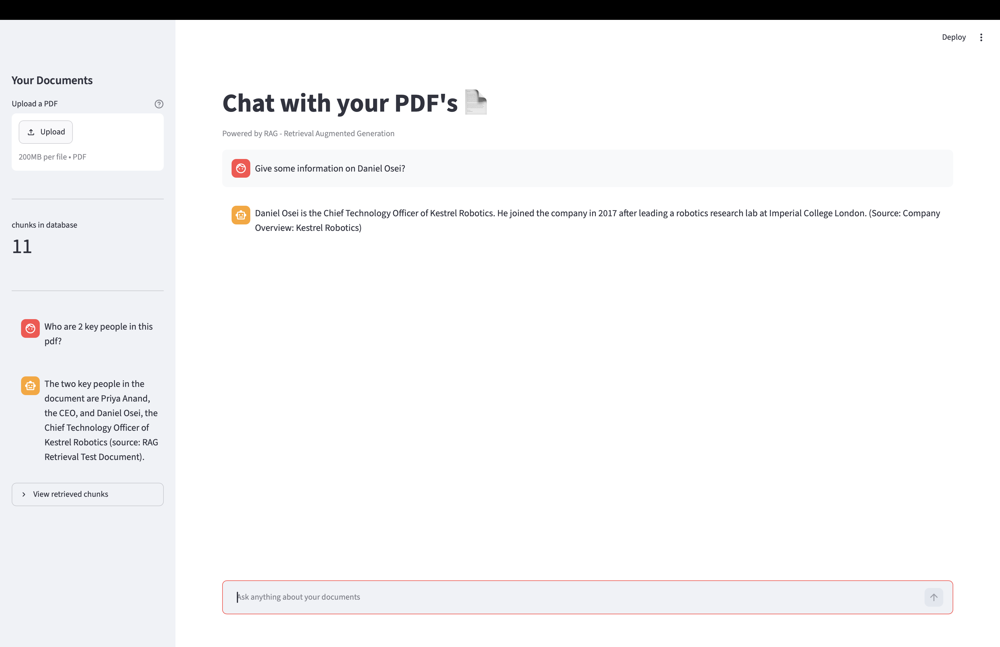

# RAG based PDF question answering app!

### This app was built with a backend of ChromaDB, FastAPI, OpenAI and a frontend of Streamlit and Requests.

## features:
- Can upload PDF's inside the app to provide context for AI to answer from
- App contains chat box to submit questions
- App keeps history of recent chats 
- Provides context about where answers come from e.g. page numbers and chunk references
- uses chunking, chunk overlapping, embedding like typical RAG applications
- Tells the user how many chunks the pdf is split into

## Architecture 
........

## Tech stack
- Python
    - FastAPI: creates platform for backend and frontend to communicate
    - OpenAI: using there API to embed pdf's and questions and to answer questions from user
    - ChromaDB: database for storing the text from pdf's and question, there embedded/vector values and the metadata.
    - Streamlit: used for frontend GUI
    - pymupdf: used to access and read text from pdf's
    - dotenv: allows user to hide their OpenAI API key in a .env file
    - pydantic: uses BaseModel to validate the data types coming in from the user's questions on the frontend
    - requests: used on the frontend to make calls to the backend

## Setup/installation/Usage
1. pip install -r requirements.txt
2. create a .env file in the root folder and add OPENAI_API_KEY={Your OpenAI key}
3. navigate to the App folder in the terminal 'cd App'
4. start running the backend with 'uvicorn backend:app --reload'
5. create a new terminal
6. start up the frontend with 'streamlit run frontend.py'
7. Add a pdf with upload button in the top left
8. Start asking questiions about your PDF in the chat box at the bottom!
9. Your Chat history will begin to appear in the bottom left

